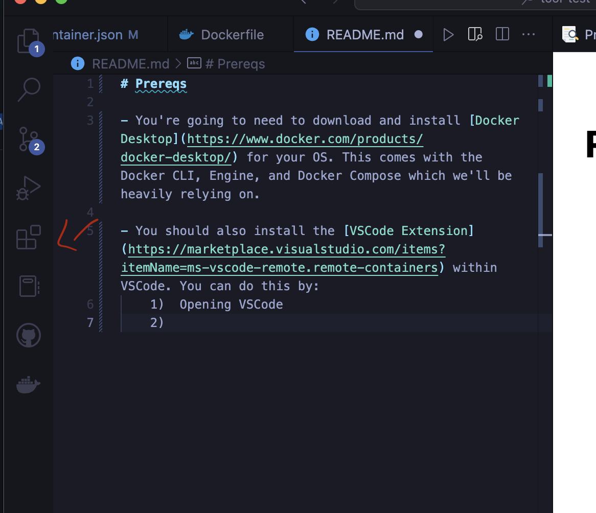
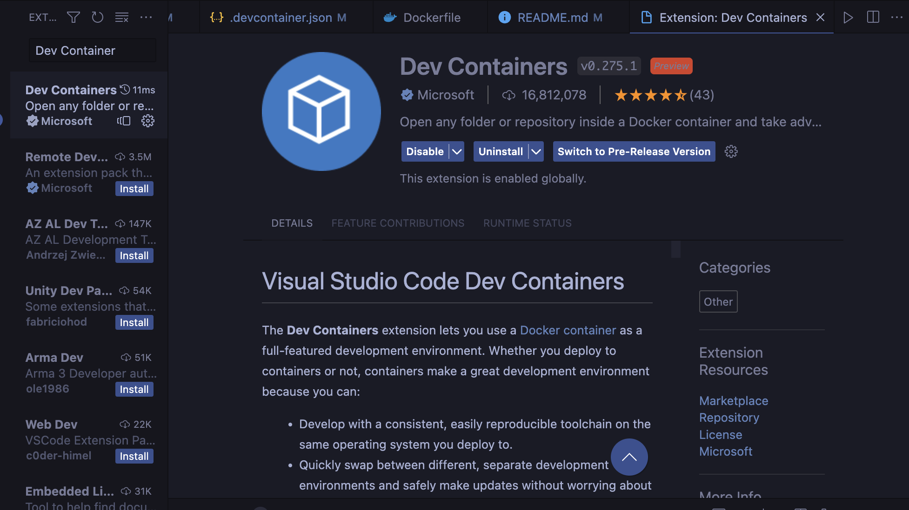
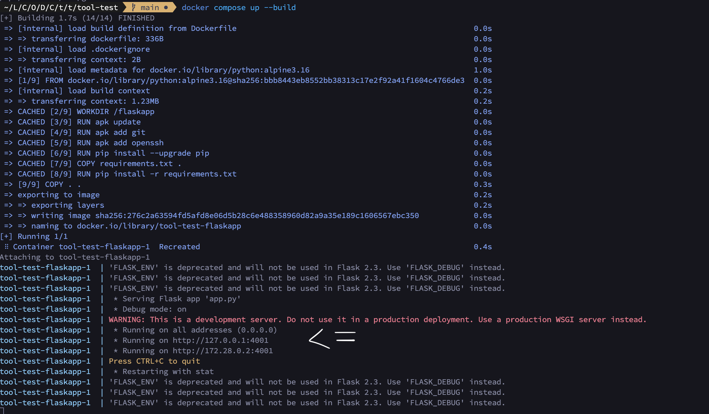
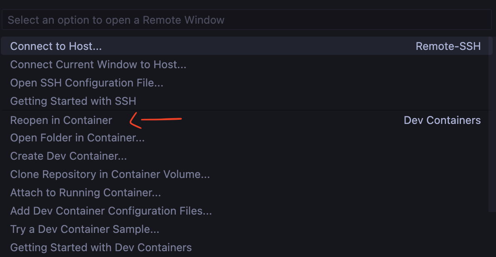

## Prereqs 

- You're going to need to download and install [Docker Desktop](https://www.docker.com/products/docker-desktop/) for your OS. This comes with the Docker CLI, Engine, and Docker Compose which we'll be heavily relying on.

- You should also install the [VSCode Extension](https://marketplace.visualstudio.com/items?itemName=ms-vscode-remote.remote-containers) within VSCode. You can do this by:
    1)  Opening VSCode
    2)  Clicking the extensions icon
    
    3) Search Dev Containers. Should look like this.
    
    4) Install
    5) Restart VSCode after installation.

## Docker Basics

- Whenever doing anything with docker, make sure its process is running in the background. 

- The only command you will generally need to run is `docker compose build` when building the a new image,`docker compose up` to start the image(s), and `docker compose down` when troubleshooting. 
    - Note:  `docker compose up --build` is the shorthand command to both build and start the image(s).

- To start run open a command terminal, preferably in the VSCode window, and run the command `docker compose build` to build a new image. This will be the crux of the development environment shared across the team.
    - The base image is alpine linux, a very small and portable distribution of linux, with python installed. There are also other applications like git and an SSH client installed for our convenience.
    - At this stage, you should not have any errors. If you do, double check that your Docker Engine is running either by reopening the program or checking your running processes.

- **The next step will utilize port 4001.** This is normally not an issue unless you know you have some other process running on this port.

- Continue by running `docker compose up`. This may take a few moments since the image has to build from scratch for the first time. On subsequent runs, the process will be radically shorter. Output should look somewhat like this.

- Note the section pointed to. Copy and paste this address in any web browser. It should open up a page created using Flask, a python API module.
    - You can also access this page by going to [localhost:4001](localhost:4001)

## Problems with this approach.
- You might have noticed that this only help when it comes to program execution. You don't have to have Python or Flask installed on your local machine but for regular coding scenarios like interactive testing, repo pushing, and debugging, this approach doesn't offer too much help.

## Dev Containers
- Dev Containers are almost exactly like you're regular setup but exist as a virtual environment. This means they can be customized and then used as a template for others' use.

- In the bottom right hand corner of your VSCode window you should see a new icon.

    1. Click it.
    2. A menu of options will pop up. Click *"Reopen in Container"*. Your options may look different depending on your other installed extensions.  

- This may take a moment to load as the container has to read and execute all the instructions for setup.

- Once you're in, 

